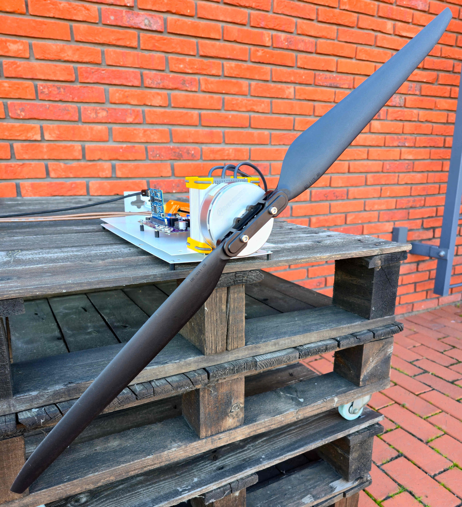
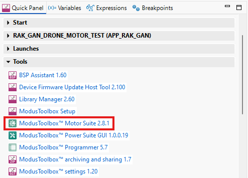
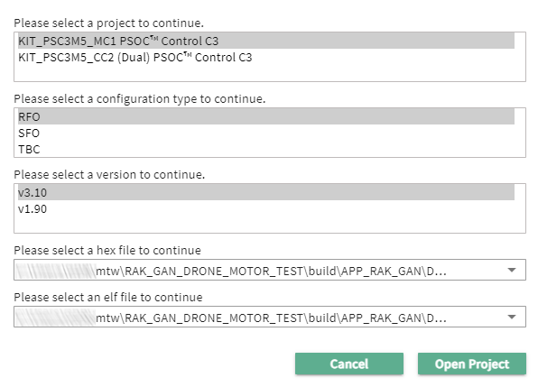
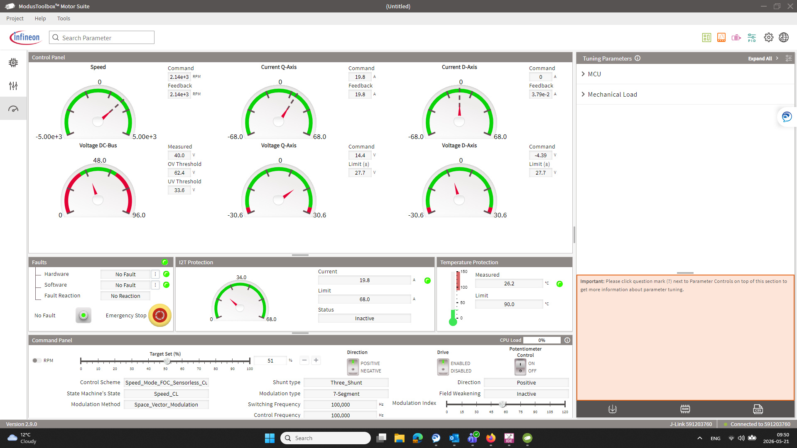
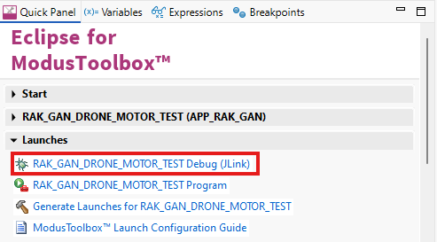

# RAK-GAN Drone Motor Test 

This code example was created for testing the RAK-GAN with the MIAT8318 100KV motor. The RAK-GAN board is equipped with a gallium nitride transistor bridge controlled by the PSOC™ Control C3M5 microcontroller.

 

## Requirements

- [ModusToolbox® software](https://www.infineon.com/cms/en/design-support/tools/sdk/modustoolbox-software/) v3.8 or later (tested with v3.8).
- Motor Suite 2.9.0 GUI.
- The latest hardware release: [RAK-GAN Rev. 1](https://github.com/RutronikSystemSolutions/RAK_GAN_Hardware_Files).
- At least 500W 48V DC Power Supply.
- At least 2.5 mm2 (14 AWG) Power Cables.
- MIAT8318 KV100 motor.

### Firmware Configuration Overview

<table>
  <tr>
    <th style="text-align: left;">Motor Control Topology:</th>
    <td>3-shunt (TMR current sensors TLE5572)</td>
  </tr>
  <tr>
    <th style="text-align: left;">Motor Control Mode:</th>
    <td>Speed Mode FOC with OL Current Startup</td>
  </tr>
  <tr>
    <th style="text-align: left;">Nominal Power Supply Voltage:</th>
    <td>48 V</td>
  </tr>
   <tr>
    <th style="text-align: left;">PWM Switching Frequency:</th>
    <td>100 kHz</td>
  </tr>
  <tr>
    <th style="text-align: left;">Rising/Falling Dead Time:</th>
    <td>50 ns</td>
  </tr>
  <tr>
    <th style="text-align: left;">Current Control Loop Bandwidth:</th>
    <td>4000 Hz</td>
  </tr>
  <tr>
    <th style="text-align: left;">Speed Control Loop Bandwidth:</th>
    <td>40 Hz</td>
  </tr>
  <tr>
    <th style="text-align: left;">PWM to Fast Loop Frequency Ratio:</th>
    <td>1:1</td>
  </tr>
  <tr>
    <th style="text-align: left;">DC Current Input Protection Trigger:</th>
    <td>25 A</td>
  </tr>
</table>


This example uses the Motor Control Driver Interface ([MCDI](https://infineon.github.io/motor-ctrl-lib/html/group__group__mcdi__general.html)); therefore, part of the configuration is managed through the ModusToolbox™ tool "Device Configurator". The rest of the configuration is in files: *ParamConfig.h*, *ParamConfig.c*, *MCU.c*

## Supported toolchains (make variable 'TOOLCHAIN')

- GNU Arm&reg; Embedded Compiler v14.2.1 (`GCC_ARM`) - Default value of `TOOLCHAIN`

## Using the code example

Create the project and open it using one of the following:

<details><summary><b>In Eclipse IDE for ModusToolbox&trade; software</b></summary>


1. Click the **New Application** link in the **Quick Panel** (or, use **File** > **New** > **ModusToolbox&trade; Application**). This launches the [Project Creator](https://www.infineon.com/ModusToolboxProjectCreator) tool.

2. Pick a kit supported by the code example from the list shown in the **Project Creator - Choose Board Support Package (BSP)** dialogue.

   When you select a supported kit, the example is reconfigured automatically to work with the kit. To work with a different supported kit later, use the [Library Manager](https://www.infineon.com/ModusToolboxLibraryManager) to choose the BSP for the supported kit. You can use the Library Manager to select or update the BSP and firmware libraries used in this application. To access the Library Manager, click the link from the **Quick Panel**.

   You can also just start the application creation process again and select a different kit.

   If you want to use the application for a kit not listed here, you may need to update the source files. If the kit does not have the required resources, the application may not work.

3. In the **Project Creator - Select Application** dialogue, choose the example by enabling the checkbox.

4. (Optional) Change the suggested **New Application Name**.

5. The **Application(s) Root Path** defaults to the Eclipse workspace which is usually the desired location for the application. If you want to store the application in a different location, you can change the *Application(s) Root Path* value. Applications that share libraries should be in the same root path.

6. Click **Create** to complete the application creation process.

For more details, see the [Eclipse IDE for ModusToolbox&trade; software user guide](https://www.infineon.com/MTBEclipseIDEUserGuide) (locally available at *{ModusToolbox&trade; software install directory}/docs_{version}/mt_ide_user_guide.pdf*).

</details>

### Operation

The motor can be controlled in two ways: using the Motor Suite GUI or by adjusting the motor's rotational speed with the potentiometer POT2. All the parameters are adjusted to work with the MIAT8318 KV100 motor and 30x11 propeller. The PID has fixed values in the *ParamConfig.c* file:

```
    // Speed Control Parameters:
#if defined(CTRL_METHOD_RFO)
    if(!params_ptr->autocal_disable.speed_control) /*Skip the calculation if this bit is set*/
    {
      //params_ptr->ctrl.speed.kp = ((8.0f / 3.0f) / (POW_TWO(params_ptr->motor.P) * params_ptr->motor.lam)) * params_ptr->mech.inertia * params_ptr->ctrl.speed.bw; // [A/(Ra/sec-elec)]
      //params_ptr->ctrl.speed.ki = ((8.0f / 3.0f) / (POW_TWO(params_ptr->motor.P) * params_ptr->motor.lam)) * params_ptr->mech.viscous * params_ptr->ctrl.speed.bw * params_ptr->ctrl.speed.ki_multiple; // [A/(Ra/sec-elec).(Ra/sec)]

	  /*MIAT 8318 100KV with mounted 30x11 propeller*/
	  params_ptr->ctrl.speed.kp = 0.005079614f;
	  params_ptr->ctrl.speed.ki = 0.01179f;

    }
    params_ptr->ctrl.speed.ff_k_inertia = ((8.0f / 3.0f) / (POW_TWO(params_ptr->motor.P) * params_ptr->motor.lam)) * params_ptr->mech.inertia; // [A/(Ra/sec-elec).sec]
    params_ptr->ctrl.speed.ff_k_viscous = ((8.0f / 3.0f) / (POW_TWO(params_ptr->motor.P) * params_ptr->motor.lam)) * params_ptr->mech.viscous; // [A/(Ra/sec-elec)]
    params_ptr->ctrl.speed.ff_k_friction = ((4.0f / 3.0f) / (params_ptr->motor.P * params_ptr->motor.lam)) * params_ptr->mech.friction; // [A]

```

The motor parameters, along with many other important settings, are in *ParamConfig.h*

```
/*******Motor*******/
#define MOTOR_POLE                                 (42.0f)                      /*[],  motor poles*/
#define MOTOR_LQ                                   (50.0E-6f)                   /*[H], Stator q-axis inductance*/
#define MOTOR_LD                                   (50.0E-6f)                   /*[H], Stator d-axis inductance*/
#define MOTOR_I_AM                                 (0.05)                       /*[Wb],  Rotor flux linkage*/
#define MOTOR_R                                    (0.055)                      /*{Ohm],  stator resistance*/
#define MOTOR_TORQUE_MAX                           (6.2f)                       /*[Nm],  maximum torque*/
#define MOTOR_CURRENT_PEAK                         (68)                         /*[A],  peak current rating*/
#define MOTOR_CURRENT_CONT                         (58)                         /*[A],  continuous current rating*/
#define MOTOR_ID_MAX                               (68)                         /*[A], maximum d-axis current*/
#define MOTOR_VOLTAGE                              (48.0f)                      /*[V], motor voltage*/
#define MOTOR_NORM_SPEED                           (4200.0f)                    /*[RPM], nominal speed*/
#define MOTOR_MAX_SPEED                            (5000.0f)                    /*[RPM],  maximum no load speed*/
#if defined(CTRL_METHOD_SFO)
#define MOTOR_MTPV_TORQUE_MARGIN                   (90.0f)                      /*[%],  MTPV torque margin*/
```

To control the motor using Motor Suite, connect the power supply to RAK-GAN, connect the USB connector to the CC1 board and PC and click on the ModusToolbox™ Motor Suite icon in the Quick Panel:



On program entry, you may select the firmware and library versions. Please do as it is shown below and click on "Open Project":



The potentiometer control is always on by default. Switch it off and slowly increase the throttle "Target Set". In this case, the motor will start spinning at 4% of maximum speed in Current Open Loop mode. At 8% of maximum speed, the observer will take over, and FOC will be engaged. 

**Note:** The MIAT8318 100 KV motor can handle up to 68 A (2.7 kW), while the RAK-GAN is rated at 25 A. The purpose of this test was to probe the system's limits without fully loading the motor. The FOC algorithm is updated every PWM cycle in this example; hence, the MCU is fully loaded and has no time margin for other processes, such as the Motor Suite oscilloscope.



**Test results:** With a mounted 80-cm-diameter propeller (30x11 CW), it produces around 6kg of pull force at 2560 RPM, 40V, 17.7A (29.9A phase current in GUI). The heatsink's temperature was 38,1°C; note that it was air-cooled by the propeller airflow.  

### Debugging

If you have successfully imported the example, the debug configurations are already prepared to use with the JLink. Open the ModusToolbox™ perspective and find the Quick Panel. Click the desired debug launch configuration, then wait for programming to complete and debugging to start.




## Legal Disclaimer

The evaluation board including the software is for testing purposes only and, because it has limited functions and limited resilience, is not suitable for permanent use under real conditions. If the evaluation board is nevertheless used under real conditions, this is done at one’s responsibility; any liability of Rutronik is insofar excluded. 


